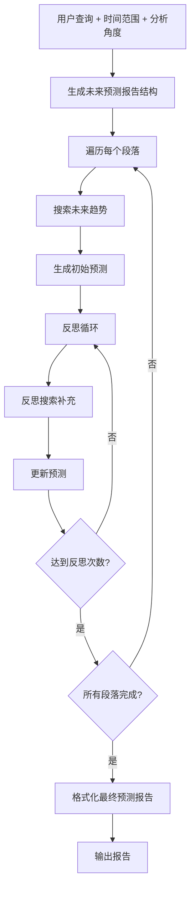
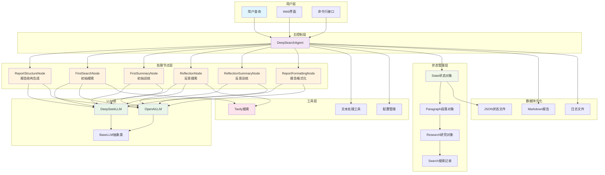

# 🔮 未来简事

[](https://python.org)
[](LICENSE)
[](https://platform.deepseek.com/)
[](https://tavily.com/)

**智能未来趋势预测与分析工具** - 通过多轮搜索和反思，帮你了解未来可能发生的事情。

> 基于 Deep Search Agent 改造，专注于未来趋势预测和分析


## ✨ 特性

- **🔮 未来预测**: 专注于未来趋势预测，而非历史回顾
- **⏰ 时间范围选择**: 支持选择1个月、3个月、6个月、1年、3年、5年等不同时间范围
- **📐 多角度分析**: 可从技术、经济、社会、环境、政治等多个角度分析未来趋势
- **🤖 多LLM支持**: 支持DeepSeek、OpenAI等主流大语言模型
- **🔍 智能搜索**: 集成Tavily搜索引擎，自动搜索未来趋势和预测信息
- **💭 反思机制**: 多轮反思优化，确保预测的深度和完整性
- **📊 状态管理**: 完整的研究过程状态跟踪和恢复
- **🌐 Web界面**: Streamlit友好界面，易于使用
- **📄 Markdown输出**: 美观的Markdown格式预测报告

## 🔄 工作原理

未来简事采用分阶段的未来预测方法：



### 核心流程

1. **结构生成**: 根据查询、时间范围和角度生成未来预测报告大纲
2. **趋势搜索**: 为每个段落搜索未来趋势、专家预测、行业分析等信息
3. **初始预测**: 基于搜索结果生成关于未来可能发生事件的初步预测
4. **反思优化**: 多轮反思，发现遗漏的未来场景并补充搜索
5. **最终整合**: 将所有段落整合为完整的Markdown格式未来预测报告

## 快速开始

### 1. 环境准备

确保您的系统安装了Python 3.9或更高版本：

```bash
python --version
```

### 2. 克隆项目

```bash
git clone <your-repo-url>
cd Demo\ DeepSearch\ Agent
```

### 3. 安装依赖

```bash
# 激活虚拟环境（推荐）
conda activate pytorch_python11  # 或者使用其他虚拟环境

# 安装依赖
pip install -r requirements.txt
```

### 4. 配置API密钥

**⚠️ 安全提示：** API 密钥是敏感信息，请勿将其提交到版本控制系统！

#### 方式一：使用环境变量（推荐）

这是最安全的方式，API 密钥不会被提交到代码仓库：

**Linux/Mac:**
```bash
export DEEPSEEK_API_KEY="your_deepseek_api_key_here"
export TAVILY_API_KEY="your_tavily_api_key_here"
export OPENAI_API_KEY="your_openai_api_key_here"  # 可选
```

**Windows (PowerShell):**
```powershell
$env:DEEPSEEK_API_KEY="your_deepseek_api_key_here"
$env:TAVILY_API_KEY="your_tavily_api_key_here"
$env:OPENAI_API_KEY="your_openai_api_key_here"  # 可选
```

**Windows (CMD):**
```cmd
set DEEPSEEK_API_KEY=your_deepseek_api_key_here
set TAVILY_API_KEY=your_tavily_api_key_here
set OPENAI_API_KEY=your_openai_api_key_here
```

#### 方式二：使用配置文件

1. 复制配置模板文件：
```bash
cp config.example.py config.py
```

2. 编辑 `config.py` 文件，填入您的 API 密钥：

```python
# Deep Search Agent 配置文件
import os

# API 密钥（优先从环境变量读取）
DEEPSEEK_API_KEY = os.getenv("DEEPSEEK_API_KEY", "your_deepseek_api_key_here")
OPENAI_API_KEY = os.getenv("OPENAI_API_KEY", "your_openai_api_key_here")
TAVILY_API_KEY = os.getenv("TAVILY_API_KEY", "your_tavily_api_key_here")

# 配置参数
DEFAULT_LLM_PROVIDER = "deepseek"
DEEPSEEK_MODEL = "deepseek-chat"
OPENAI_MODEL = "gpt-4o-mini"

MAX_REFLECTIONS = 2
SEARCH_RESULTS_PER_QUERY = 3
SEARCH_CONTENT_MAX_LENGTH = 20000
OUTPUT_DIR = "reports"
SAVE_INTERMEDIATE_STATES = True
```

**注意：** `config.py` 文件已被添加到 `.gitignore`，不会被提交到版本控制。如果使用配置文件方式，请确保不要将包含真实密钥的 `config.py` 文件提交到仓库。

### 5. 开始使用

现在您可以开始使用Deep Search Agent了！

## 使用方法

### 方式一：运行示例脚本

**基本使用示例**：
```bash
python examples/basic_usage.py
```
这个示例展示了最简单的使用方式，执行一个预设的研究查询并显示结果。

**高级使用示例**：
```bash
python examples/advanced_usage.py
```
这个示例展示了更复杂的使用场景，包括：
- 自定义配置参数
- 执行多个研究任务
- 状态管理和恢复
- 不同模型的使用

### 方式二：Web界面（推荐）

启动Streamlit Web界面：
```bash
streamlit run examples/streamlit_app.py
```

Web界面功能：
- 🎯 选择未来时间范围（1个月到5年）
- 📐 选择分析角度（技术、经济、社会等）
- 🔑 直接在界面中输入API密钥
- 📊 实时查看预测进度
- 💾 下载预测报告

### 方式三：编程方式

```python
from src import DeepSearchAgent, load_config, Config

# 加载配置
config = load_config()

# 设置未来简事参数
config.time_horizon = "3个月"  # 时间范围
config.analysis_angles = ["技术", "经济", "社会"]  # 分析角度

# 创建Agent
agent = DeepSearchAgent(config)

# 执行未来预测
query = "人工智能的发展"
final_report = agent.research(
    query, 
    save_report=True,
    time_horizon="3个月",
    analysis_angles=["技术", "经济"]
)

print(final_report)
```

### 方式四：自定义配置（编程方式）

如果需要在代码中动态设置配置，可以使用以下方式：

```python
from src import DeepSearchAgent, Config

# 自定义配置
config = Config(
    default_llm_provider="deepseek",
    deepseek_model="deepseek-chat",
    max_reflections=3,           # 增加反思次数
    max_search_results=5,        # 增加搜索结果数
    output_dir="future_reports", # 自定义输出目录
    time_horizon="1年",          # 未来时间范围
    analysis_angles=["技术", "经济", "社会", "环境"]  # 分析角度
)

# 设置API密钥
config.deepseek_api_key = "your_api_key"
config.tavily_api_key = "your_tavily_key"

agent = DeepSearchAgent(config)

# 执行预测
report = agent.research("电动汽车市场发展")
```

## 项目结构

```
Demo DeepSearch Agent/
├── src/                          # 核心代码
│   ├── llms/                     # LLM调用模块
│   │   ├── base.py              # LLM基类
│   │   ├── deepseek.py          # DeepSeek实现
│   │   └── openai_llm.py        # OpenAI实现
│   ├── nodes/                    # 处理节点
│   │   ├── base_node.py         # 节点基类
│   │   ├── report_structure_node.py  # 结构生成
│   │   ├── search_node.py       # 搜索节点
│   │   ├── summary_node.py      # 总结节点
│   │   └── formatting_node.py   # 格式化节点
│   ├── prompts/                  # 提示词模块
│   │   └── prompts.py           # 所有提示词定义
│   ├── state/                    # 状态管理
│   │   └── state.py             # 状态数据结构
│   ├── tools/                    # 工具调用
│   │   └── search.py            # 搜索工具
│   ├── utils/                    # 工具函数
│   │   ├── config.py            # 配置管理
│   │   └── text_processing.py   # 文本处理
│   └── agent.py                 # 主Agent类
├── examples/                     # 使用示例
│   ├── basic_usage.py           # 基本使用示例
│   ├── advanced_usage.py        # 高级使用示例
│   └── streamlit_app.py         # Web界面
├── reports/                      # 输出报告目录
├── requirements.txt              # 依赖列表
├── config.py                    # 配置文件
└── README.md                    # 项目文档
```

## 代码结构



## API 参考

### DeepSearchAgent

主要的Agent类，提供完整的深度搜索功能。

```python
class DeepSearchAgent:
    def __init__(self, config: Optional[Config] = None)
    def research(self, query: str, save_report: bool = True) -> str
    def get_progress_summary(self) -> Dict[str, Any]
    def load_state(self, filepath: str)
    def save_state(self, filepath: str)
```

### Config

配置管理类，控制Agent的行为参数。

```python
class Config:
    # API密钥
    deepseek_api_key: Optional[str]
    openai_api_key: Optional[str] 
    tavily_api_key: Optional[str]
    
    # 模型配置
    default_llm_provider: str = "deepseek"
    deepseek_model: str = "deepseek-chat"
    openai_model: str = "gpt-4o-mini"
    
    # 搜索配置
    max_search_results: int = 3
    search_timeout: int = 240
    max_content_length: int = 20000
    
    # Agent配置
    max_reflections: int = 2
    max_paragraphs: int = 5
```

## 示例

### 示例1：基本未来预测

```python
from src import create_agent

# 快速创建Agent
agent = create_agent()

# 执行未来预测（使用配置中的时间范围和角度）
report = agent.research("量子计算的发展")
print(report)
```

### 示例2：自定义未来预测参数

```python
from src import DeepSearchAgent, Config

config = Config(
    max_reflections=4,        # 更深度的反思
    max_search_results=8,     # 更多搜索结果
    max_paragraphs=6,         # 更长的报告
    time_horizon="1年",       # 预测未来1年
    analysis_angles=["技术", "社会", "伦理"]  # 从技术、社会、伦理角度分析
)

agent = DeepSearchAgent(config)
report = agent.research("人工智能的伦理问题")
```

### 示例3：状态管理和进度跟踪

```python
# 开始未来预测
config = Config(time_horizon="6个月", analysis_angles=["技术", "经济"])
agent = DeepSearchAgent(config)
report = agent.research("区块链技术应用")

# 保存状态
agent.save_state("blockchain_future.json")

# 稍后恢复状态
new_agent = DeepSearchAgent(config)
new_agent.load_state("blockchain_future.json")

# 检查进度
progress = new_agent.get_progress_summary()
print(f"预测进度: {progress['progress_percentage']}%")
```

## 高级功能

### 多模型支持

```python
# 使用DeepSeek
config = Config(default_llm_provider="deepseek")

# 使用OpenAI
config = Config(default_llm_provider="openai", openai_model="gpt-4o")
```

### 自定义输出

```python
config = Config(
    output_dir="custom_reports",           # 自定义输出目录
    save_intermediate_states=True          # 保存中间状态
)
```

## 常见问题

### Q: 支持哪些LLM？

A: 目前支持：
- **DeepSeek**: 推荐使用，性价比高
- **OpenAI**: GPT-4o、GPT-4o-mini等
- 可以通过继承`BaseLLM`类轻松添加其他模型

### Q: 如何获取API密钥？

A: 
- **DeepSeek**: 访问 [DeepSeek平台](https://platform.deepseek.com/) 注册获取
- **Tavily**: 访问 [Tavily](https://tavily.com/) 注册获取（每月1000次免费）
- **OpenAI**: 访问 [OpenAI平台](https://platform.openai.com/) 获取

获取密钥后，直接编辑项目根目录的`config.py`文件填入即可。

### Q: 未来预测报告质量如何提升？

A: 可以通过以下方式优化：
- 选择合适的时间范围（短期预测通常更准确）
- 选择多个分析角度，获得更全面的视角
- 增加`max_reflections`参数（更多反思轮次）
- 增加`max_search_results`参数（更多搜索结果）
- 调整`max_content_length`参数（更长的搜索内容）
- 使用更强大的LLM模型（如GPT-4o）

### Q: 如何选择时间范围？

A: 
- **1-3个月**: 适合预测近期可能发生的事件和短期趋势
- **6个月-1年**: 适合预测中期发展趋势和可能的变化
- **3-5年**: 适合预测长期趋势和重大变革

### Q: 分析角度如何选择？

A: 根据你的查询主题选择相关角度：
- **技术**: 技术发展趋势、创新突破
- **经济**: 市场变化、经济影响
- **社会**: 社会趋势、生活方式变化
- **环境**: 环境影响、可持续发展
- **政治**: 政策变化、法规影响
- 可以多选，获得更全面的分析

### Q: 如何自定义提示词？

A: 修改`src/prompts/prompts.py`文件中的系统提示词，可以根据需要调整Agent的行为。

### Q: 支持其他搜索引擎吗？

A: 当前主要支持Tavily，但可以通过修改`src/tools/search.py`添加其他搜索引擎支持。

## 贡献

欢迎贡献代码！请遵循以下步骤：

1. Fork本项目
2. 创建特性分支 (`git checkout -b feature/AmazingFeature`)
3. 提交更改 (`git commit -m 'Add some AmazingFeature'`)
4. 推送到分支 (`git push origin feature/AmazingFeature`)
5. 开启Pull Request

## 许可证

本项目采用MIT许可证 - 查看 [LICENSE](LICENSE) 文件了解详情。

## 致谢

- 感谢 [DeepSeek](https://www.deepseek.com/) 提供优秀的LLM服务
- 感谢 [Tavily](https://tavily.com/) 提供高质量的搜索API

---

如果这个项目对您有帮助，请给个Star！
